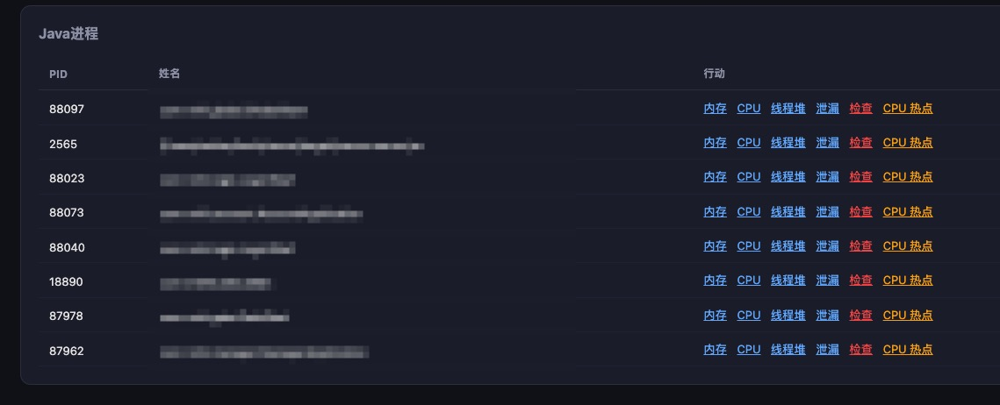
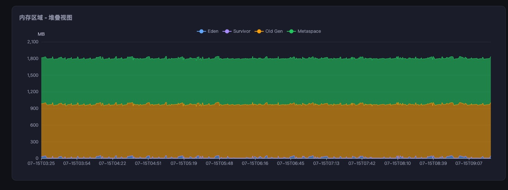
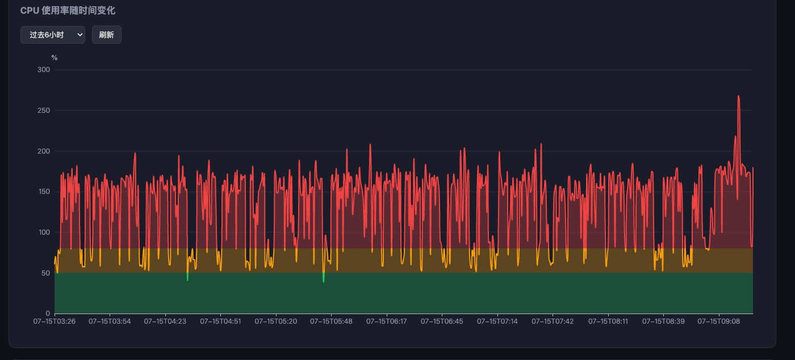
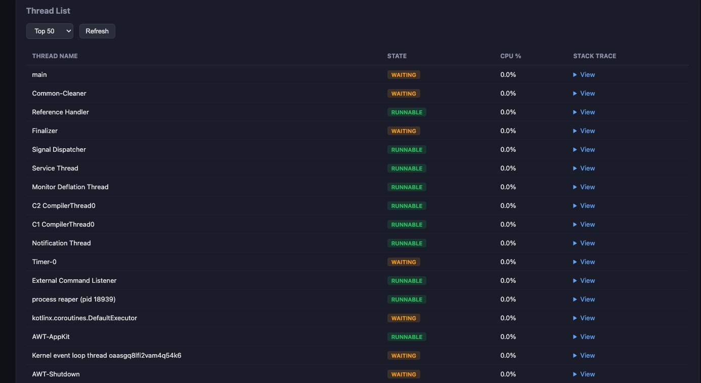
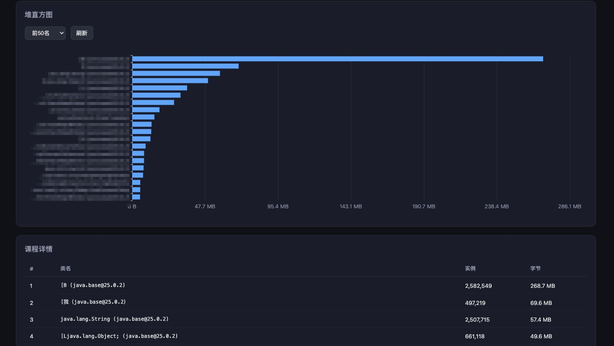
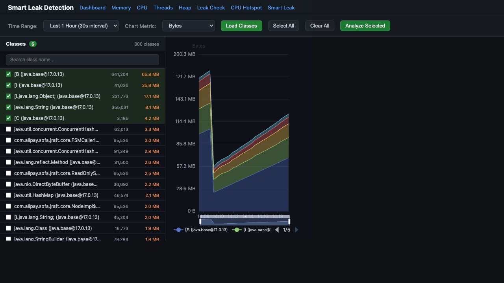

# jmon - JVM Process Monitor

轻量级 JVM 进程监控与诊断工具，自动发现并监控所有 Java 进程，提供内存、CPU、线程、堆、泄漏检测等全方位诊断能力。

## 特性

- **零配置启动** — 直接运行 `jmon` 即可，自动发现并监控所有 Java 进程
- **暗色主题 Web UI** — 基于 ECharts 的现代化监控面板
- **内存监控** — Eden / Survivor / Old Gen / Metaspace 堆叠视图
- **CPU 监控** — 实时 CPU 使用率趋势图，支持多核累计
- **线程分析** — 线程列表、状态、CPU 占用、堆栈快照
- **堆直方图** — Top N 类实例数与内存占用分析
- **泄漏检测** — 内存增长趋势分析
- **智能泄漏检测** — 按类粒度追踪内存变化趋势，支持密集（1小时）和长期（7天）两种模式
- **CPU 热点** — 线程级 CPU 热点定位
- **登录认证** — 内置用户名/密码认证
- **跨平台** — 支持 macOS / Linux / Windows

## 快速开始

### 安装

**macOS / Linux：**

```bash
# 解压
unzip jmon-macOS-arm64.zip  # 或 jmon-linux-amd64.zip
cd jmon-macOS-arm64

# 安装
chmod +x install.sh
sudo ./install.sh
```

**Windows：**

解压 `jmon-windows-amd64.zip`，将 `jmon.exe` 添加到 PATH。

### 启动

```bash
jmon
```

启动后自动在浏览器中打开 Dashboard（默认 `http://localhost:9810`）。

### 常用命令

```bash
jmon              # 启动 daemon，监控所有 Java 进程
jmon stop         # 停止 daemon
jmon restart      # 重启 daemon
```

### 配置

首次启动会自动生成配置文件 `~/.jmon/config.json`：

```json
{
  "username": "jmon",
  "password": "jmon"
}
```

修改后执行 `jmon restart` 生效。

### 启动参数

```bash
jmon --port 8080        # 自定义端口（默认 9810）
jmon --interval 10      # 自定义采集间隔秒数（默认 30）
```

## 截图

### 进程列表

自动发现所有 Java 进程，提供内存、CPU、线程、泄漏检测等一键入口。



### 内存监控

堆内存区域（Eden / Survivor / Old Gen / Metaspace）堆叠视图，直观观察内存变化趋势。



### CPU 监控

CPU 使用率随时间变化，颜色分层标识低/中/高负载区间。



### 堆直方图

Top N 类的实例数与内存占用分析，快速定位内存大户。



### 线程分析

线程列表、状态（RUNNABLE / WAITING / BLOCKED）、CPU 占用、堆栈快照。



### 智能泄漏检测

按类粒度追踪内存变化趋势。加载最新快照的 Top 300 个类，勾选感兴趣的类后查看其内存趋势图。支持两种时间范围：

- **Last 1 Hour** — 每 30 秒采集一次，保留 1 小时数据，适合密集分析
- **Last 7 Days** — 每整点采集一次，保留 7 天数据，适合长期趋势观察



## 下载

| 平台 | 架构 | 下载 |
|------|------|------|
| macOS | Intel (x86_64) | [jmon-macOS-amd64.zip](dist/jmon-macOS-amd64.zip) |
| macOS | Apple Silicon (arm64) | [jmon-macOS-arm64.zip](dist/jmon-macOS-arm64.zip) |
| Linux | x86_64 | [jmon-linux-amd64.zip](dist/jmon-linux-amd64.zip) |
| Windows | x86_64 | [jmon-windows-amd64.zip](dist/jmon-windows-amd64.zip) |

## 系统要求

- **JDK** — 需要安装 JDK（提供 `jps`、`jstack`、`jmap`、`jstat` 命令）
- **Go 1.21+** — 仅从源码编译时需要

## 从源码编译

```bash
git clone <repo>
cd jmon
go build -o jmon .
go install .
```

## 架构

```
jmon
├── cmd/           # CLI 命令定义（root / stop / restart / _run）
├── internal/
│   ├── analyzer/  # 泄漏检测、CPU 热点分析
│   ├── collector/ # 数据采集（jps/jstack/jmap/jstat/ps）
│   ├── config/    # 配置加载（~/.jmon/config.json）
│   ├── daemon/    # 守护进程生命周期管理
│   ├── storage/   # SQLite 数据存储（~/.jmon/jmon.db）
│   └── web/       # Web UI 与 REST API
└── main.go        # 入口
```

## License

MIT
